# 📦 Tecnozine – Gestor de Stock Tecnológico

**Tecnozine** es una aplicación de gestión de stock de productos tecnológicos, desarrollada durante mis prácticas como estudiante, en colaboración con un equipo de 4 compañeros. 

La app fue desarrollada con **Flutter** y utiliza **Firebase** como backend. Su objetivo es facilitar el control del inventario, el historial de movimientos y el seguimiento del stock, incluyendo alertas por productos bajos.

---

## 🧰 Tecnologías utilizadas

- **Flutter** (Dart)
- **Firebase Auth**
- **Cloud Firestore**
- **Realtime Database**
- **Firebase Messaging** (notificaciones)
- **Material 3 Design**
- **PDF & CSV export packages**
- **Dark/Light Mode Support**

---

## 🛠️ Funcionalidades principales

- 🔐 **Login** con autenticación por Firebase
- 🏠 **Pantalla principal (Home):**
  - Lista de productos en tarjetas
  - Botón de añadir nuevo producto
  - Menú de cada producto: editar / eliminar
  - Filtro de productos por nombre
- 📥 **Historial de movimientos** (consultable desde el menú lateral)
- 📄 **Exportación de historial** en formato **PDF** y **CSV**
- 🌙 **Modo claro / oscuro** desde el drawer
- 🔔 **Notificaciones** de stock bajo
- 🚪 **Cerrar sesión**

---

## 👨‍💻 Mi contribución al proyecto

Durante el desarrollo de Tecnozine, participé principalmente en:

- 🧱 Creación de la **pantalla principal (home_screen)**
- ➕ Funcionalidades de **añadir, editar y eliminar productos**
- 🧠 Estructura y lógica de la base de datos en **Firestore** y **Realtime Database**
- 📊 Implementación del **historial de movimientos**
- 📤 Exportación del historial a **PDF y CSV**
- 🌓 Implementación del **modo claro / oscuro**

---

## 👥 Créditos del equipo

Este proyecto fue desarrollado por:

- [Mariana Torres](https://github.com/mp-tq)  
- [Rafael Portillo](https://github.com/Rafaporti98)  
- [David Ropero](https://github.com/DavidRS0011)
- [Iván Aneas](https://github.com/IvanAneas)
- [Héctor Porcel](https://github.com/Sporcel)

---

## 📸 Capturas de pantalla

### 🏠 Login
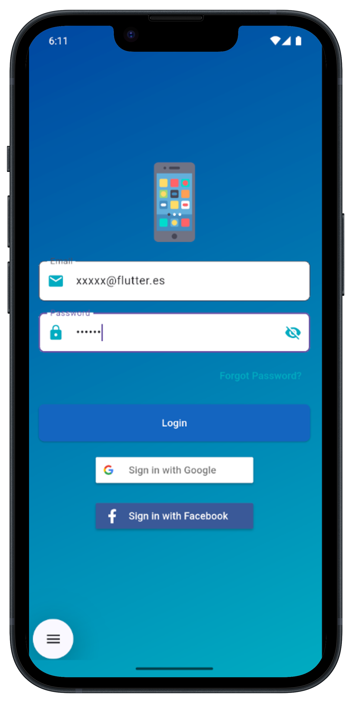

### 🏠 Pantalla principal
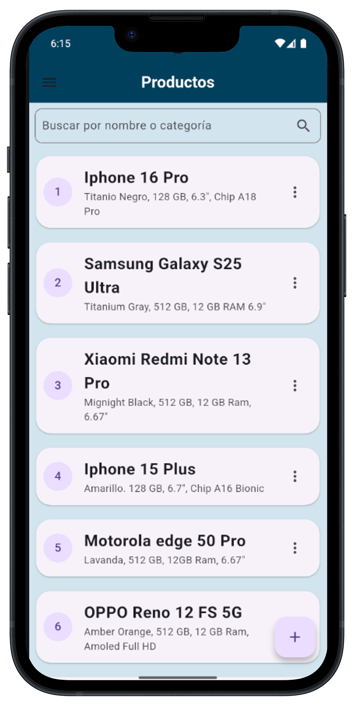

### ➕ Añadir producto
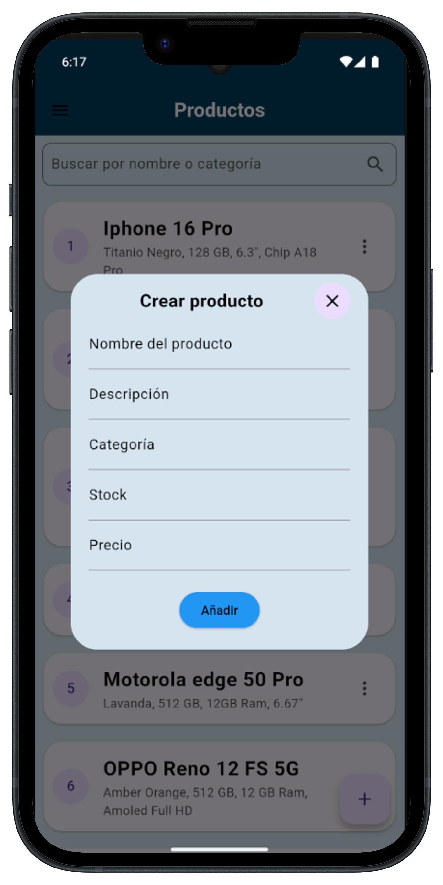

### ✏️ Editar producto
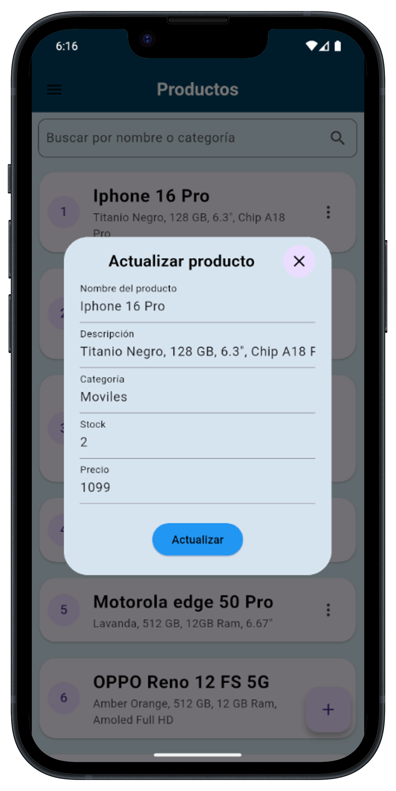

### ➕ Filtrar producto
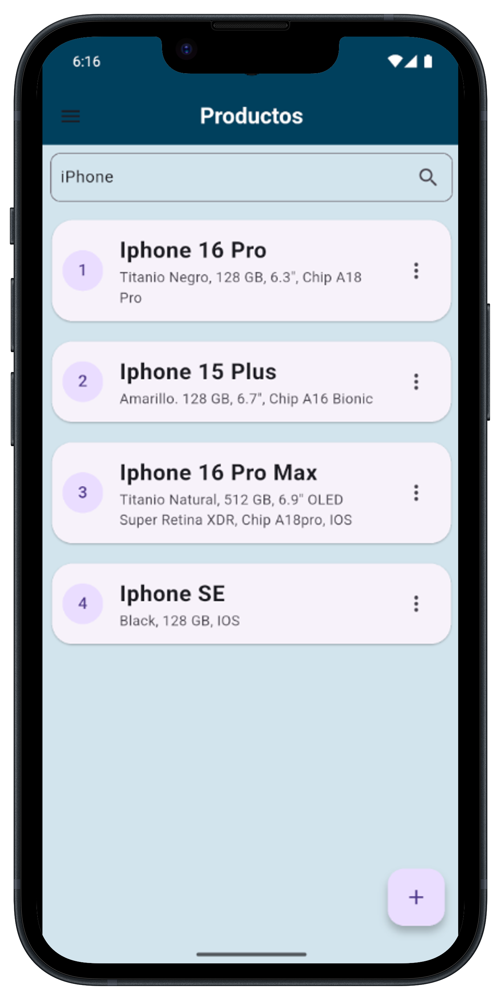

### ✏️ Editar / Eliminar producto
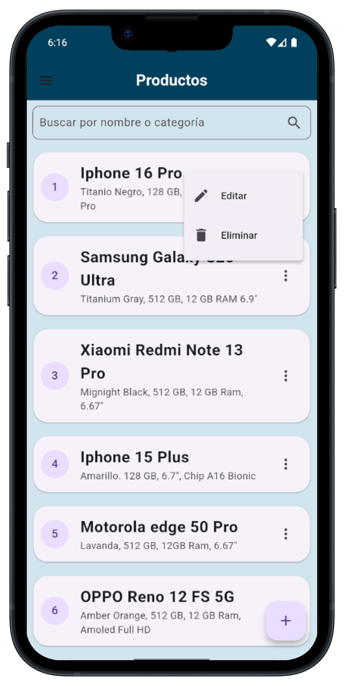

### ➕ Drawer
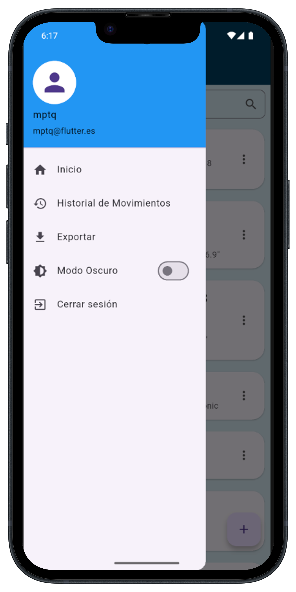

### 📄 Historial movimientos
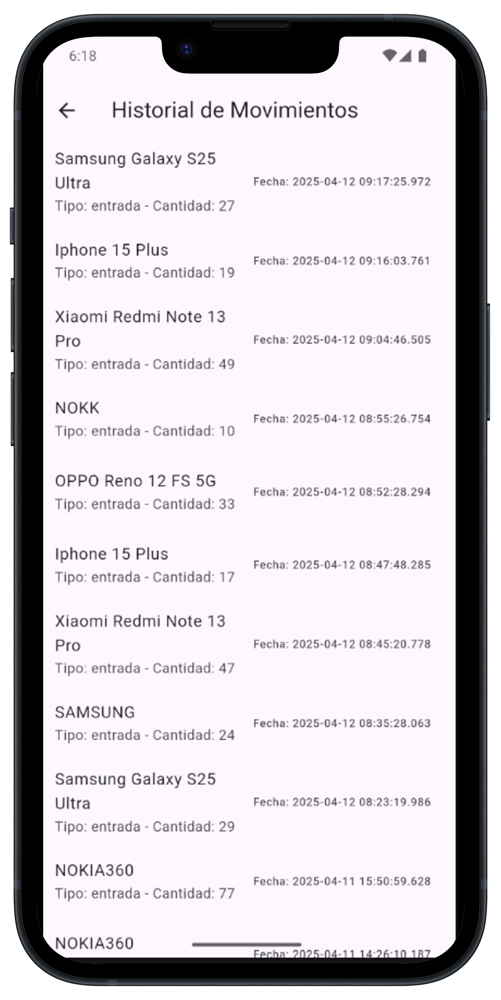

### 📄 Exportar pdf/csv
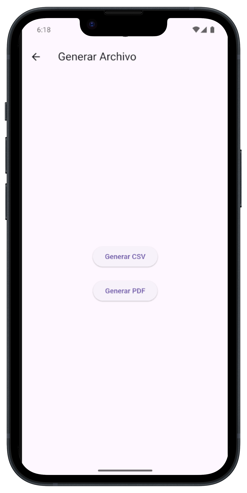

### 🌙 Modo oscuro1
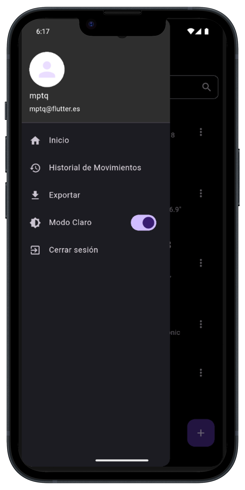

### 🌙 Modo oscuro2
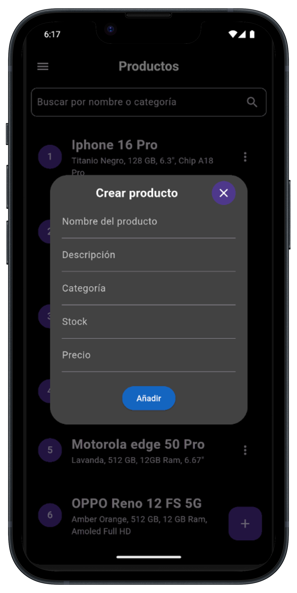
---

